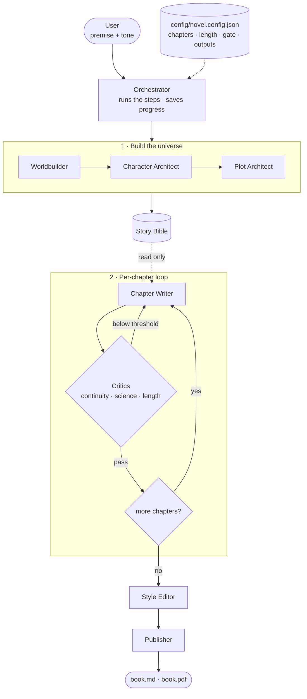

> ⚠️ **Aviso (2026-09-23, 20:30 UTC).** El repositorio del examen que tiene el
> código, la spec aprobada (`SPEC-EXAM-001`), el plan por horas (`PLAN-001-exam`)
> y los cinco briefs es **https://github.com/davidcalham12/StoryMaker**, clonado
> de `novaforge-v2` @ `055c31d` con historia. Este repo (`My-story`) conserva el
> esqueleto del 15-09 y los documentos de la sesión de diseño (`docs/HANDBOOK.md`,
> `docs/EXAM-PLAN.md`, `docs/EXAM-RUNBOOK.md`) como referencia. **Pendiente de
> que el dueño confirme cuál es la entrega.** Decisiones del dueño ya tomadas:
> entrega **viernes 2026-09-25 por la mañana**; empresa presentadora **Qaracter**
> (identidad del sistema de diseño de la organización); lectura en **PDF**, no
> web; novelas en Haiku.

# storyMaker (repo `My-story`) — novelas personalizadas para regalar

**Estado a 2026-09-23.** Este es el repositorio del **examen final** de *Harness
Engineering*. Aquí se construye storyMaker sobre lo aprendido en NovaForge.
Empieza por:

| quieres | lee |
|---|---|
| qué se ha hecho, qué fue lo último, quién es quién | [`docs/HANDBOOK.md`](docs/HANDBOOK.md) |
| **el orden de trabajo del examen, paso a paso** | [`docs/EXAM-RUNBOOK.md`](docs/EXAM-RUNBOOK.md) |
| el enunciado decodificado: qué aprueba, qué se reutiliza, qué es nuevo | [`docs/EXAM-PLAN.md`](docs/EXAM-PLAN.md) |
| el harness vivo del que parte todo | https://github.com/davidcalham12/novaforge-v2 (rama `backend-v1`) |
| el traspaso completo de la sesión de diseño | https://github.com/davidcalham12/nova-repo (`00-HANDOFF.md`) |
| skills, herramientas y todos los enlaces del curso | https://github.com/davidcalham12/my-factory |

Lo que sigue debajo es el README original del 15 de septiembre — describe la
**v1** (motor `mock`, tres críticos, PDF). Se conserva como histórico; **no
describe el estado actual**.

---

# NovaForge

A multi-agent harness that writes short science-fiction novels.

## The idea

Instead of one prompt writing a whole book, a small team of specialised agents cooperates
under a fixed process:

1. **Build the universe** — three agents write the *Story Bible* (world rules, characters,
   timeline, open mysteries, chapter outline). The Bible is the single source of truth.
2. **Write chapter by chapter** — a writer drafts each chapter reading only the Bible and a
   short summary of what came before. Critics score the draft (continuity, science, length).
   Below the threshold, the chapter is rewritten — up to a fixed number of times.
3. **Polish and publish** — an editor unifies the voice; the publisher exports Markdown and PDF.

The orchestrator only sequences the steps and saves progress, so a run can be resumed.
The model is swappable: a deterministic offline `mock` engine lets the whole pipeline run
with no API key and no cost.

## Start small, grow by configuration

The harness starts with tiny novels (3 chapters, ~400 words each). Everything that shapes the
novel — chapters, words and lines per chapter, quality threshold, retries, budget, output
formats — lives in `config/novel.config.json`. Scaling up to a full novel is a change in that
file, never in the code.

## Flow

## Specs

- [`specs/NOVAFORGE-SPEC.md`](specs/NOVAFORGE-SPEC.md) — the harness specification: memory
  architecture (short-term context, long-term Bible, summaries, episodic critiques, state),
  the agents with comparable input/output contracts, skills, runtime and development tools,
  configuration, quality gate, observability, tests and recommendations.
- [`config/novel.config.json`](config/novel.config.json) — the configuration file itself
  (`tiny` profile: 3 chapters, 300–550 words each, Markdown + PDF output).
