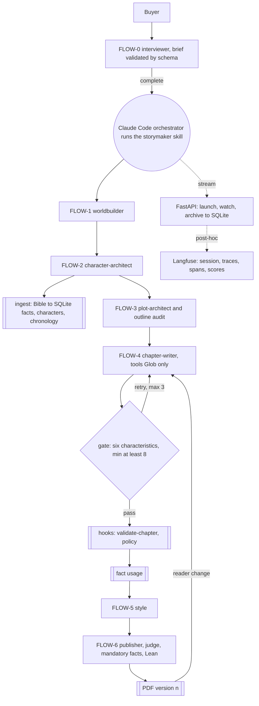

# Harness architecture

```mermaid
flowchart TD
  B[Buyer] --> I[FLOW-0 interviewer, brief validated by schema]
  I -->|complete| O((Claude Code orchestrator runs the storymaker skill))
  O --> W[FLOW-1 worldbuilder] --> C[FLOW-2 character-architect]
  C --> ING[[ingest: Bible to SQLite facts, characters, chronology]]
  C --> P[FLOW-3 plot-architect and outline audit]
  P --> CH[FLOW-4 chapter-writer, tools Glob only]
  CH --> G{gate: six characteristics, min at least 8}
  G -->|retry, max 3| CH
  G -->|pass| H[[hooks: validate-chapter, policy]]
  H --> FU[[fact usage]]
  FU --> S[FLOW-5 style] --> PUB[FLOW-6 publisher, judge, mandatory facts, Lean]
  PUB --> PDF[[PDF version n]]
  PDF -->|reader change| CH
  O -.stream.-> API[FastAPI: launch, watch, archive to SQLite]
  API -.post-hoc.-> LF[Langfuse: session, traces, spans, scores]
```
