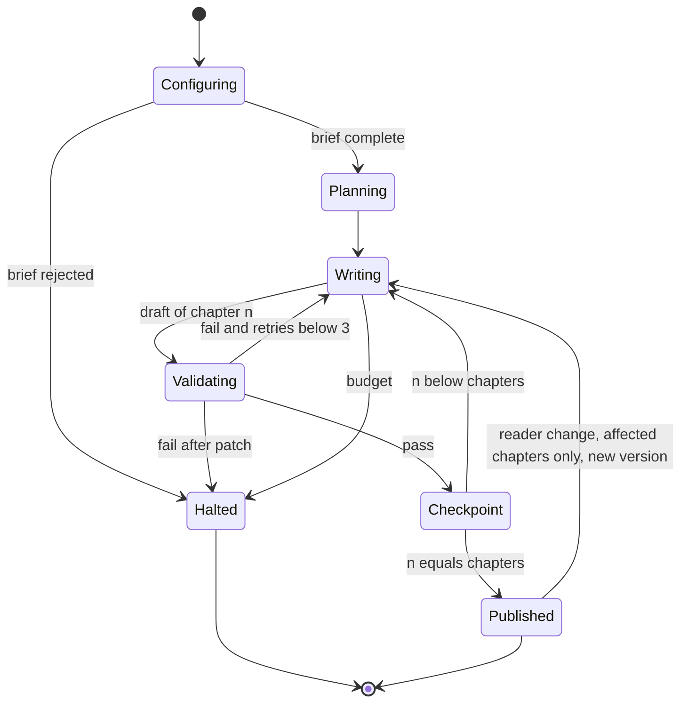

# Generation as a state machine (what the TLA+ specification models)

Safety: no published version contains a chapter that did not pass; resuming from a checkpoint neither duplicates nor loses a chapter; a previous version is never modified; retries never exceed the limit. Liveness: every generation ends in Published or Halted.
